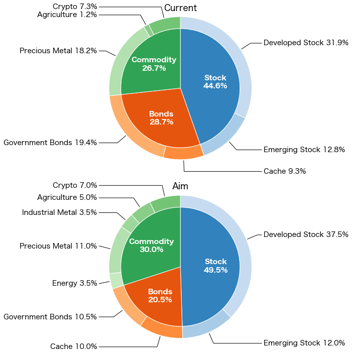

# Easy Robo-Advisors

Advise rebalance policy based on your portfolio and investment policy.

Access to asesst account via [y\-muen/assets\-checker](https://github.com/y-muen/assets-checker).

## Expected User

* ETF-based Long-term investor.
* Alady have own investment policy.
* Include cryptos as commodity.
* Buy and cell by your own.

## Usage
Currently,  you need to have accounts at all of SBI証券, マネックス証券, bitFlyer.

You also need to deside the portfolio to achive yourself.
Sample of portfolio is located as [portfolio.csv](./portfolio.csv).
Edit and save it to `path_to_target_csv`.
For more detail, see [Portfolio to achive](#portfolio-to-achive) section.

Acquire `api_key` and `api_secret` from [bitFlyer Lightning API](https://lightning.bitflyer.com/docs?lang=ja&_gl=1*t1rrjv*_ga*NzU1MzkzODkzLjE2NDg3OTU3MTg).

As a first step, load your information.
```
from easy_robo_advisors.portfolio import Portfolio

obj = Portfolio()
obj.bitflyer_api_key = "api_key"
obj.bitflyer_api_secret = "api_secret"
obj.update_accounts()

obj.update_target_from_csv("path_to_target_csv")
```
`Portfolio` has proposal and visualization ablitiy.

### Proposal
You can see the proposal to achive the targe portoflio.

1. Update propsal.
```
obj.update_propose()
```
2. See prosal of each account `account`
```
obj.propose(account)
```
`account` is name of your brokerage account, e.g. "SBI".
The list of available `account` can be listed by `obj.proposable`
```
print(pf.proposable)
```
By default, `Portfolio` use parameter of montly income `income = 50000` , month to achive `delay = 3`, acceptable deviation rate `tor = 0.2`.
You can cutumize as below.
```
obj.income = 100000
obj.delay = 1
obj.tor = 0.1
obj.update_propose()
```

### Visualization
`obj.plot` show the cuurent and target portforlio.
```
import matplotlib.pyplot as plt

fig, (ax1, ax2) = plt.subplots(2, 1, figsize=(12,12))
obj.plot(ax1, "valuation", "Current")
obj.plot(ax2, "weight", "Aim")
```


### Portfolio to achive
Template is uploaded to [Google Spreadsheet](https://docs.google.com/spreadsheets/d/1xOTvJ2PryIvzv73b_AnBhUeMyFxKQ1rqzJRys91Sqfw/edit?usp=sharing).

We cassify aseest into  `Stock` ,`Bonds` and `Commodity`.

The subclassification are in the following table.

|    type     |       datail       |
| ----------- | ------------------ |
| `Stock`     | `Developed Stock`  |
|             | `Emerging Stock`   |
|             | `Real Estate`      |
|             | `Corporate Bonds`  |
| `Bonds`     | `Cache`            |
|             | `Government Bonds` |
| `Commodity` | `Energy`           |
|             | `Precious Metal`   |
|             | `Industrial Metal` |
|             | `Agriculture`      |
|             | `Crypto`           |

### Options
If you use Chromium browser but not Chrome, use `binary_location`.
```
from selenium.webdriver.chrome.options import Options

options = Options()
options.binary_location = "/Applications/Brave Browser.app/Contents/MacOS/Brave Browser"
```

If you use browser extentions, setting profile via `--user-data-dir` is covininet.
```
options.add_argument(f"--user-data-dir=/Users/USERNAME/.config/selenium/cache")
```

Pass the option at `update_accounts`.
```
obj.update_accounts(options)
```

## See Also

* [ロボアドバイザーは自作できる？ | ロボアドバイザー・ラボ【公式サイト】](https://robot-adviser.org/robot-adviser-general-info/robot-adviser-jisaku-76993536/)
